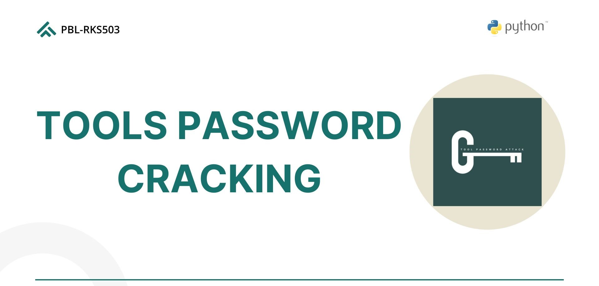

# Passcrack 



### About Passcrack

Passcrack is a tool designed to perform brute force attacks, dictionary attacks, and hash cracking using rainbow tables. It helps identify weak passwords and improve system security.

This project is maintained by [Diaz Sabat Dolly Silitonga](https://github.com/diaz-afk), [Naufal Kanz](https://twitter.com/Jhaddix), [Naya Amanda](https://blog.g0tmi1k.com/), [Muhammad Hadi Khairullah](https://github.com/ItsIgnacioPortal), [Ahmad Rizqi Hafil Ardhi](https://github.com/BananaMoustache), [Mutiara Putri](https://blog.g0tmi1k.com/).

---

## Main Features

- **Brute Force**: Attempts various username and password combinations based on specific lengths and characters.
- **Dictionary Attack**: Uses a predefined list of usernames and passwords to match credentials.
- **Rainbow Table**:
  - Creates a new rainbow table.
  - Sorts the rainbow table for efficiency.
  -  Cracking hashes using rainbow tables.

---

## Disclaimer

This tool is designed for security testing with authorised permissions. Use for illegal or unauthorised activities is the sole responsibility of the user.

---

## Installation

Passcrack requires [Python 3.x](https://www.python.org/downloads/) to run.

### Repository Cloning:
```sh
git clone https://github.com/username/passcrack.git
cd passcrack
```

### Installing Dependencies:
```sh
pip install -r requirements.txt
```

### Running the Tool:
```sh
python3 passcrack.py
```

---

## Usage Guidelines

### Brute Force Attack

#### Example: Brute Force for Password Only
```sh
python3 passcrack.py -b --url http://target/login -username admin -password -c 5 -length 4
```

- **-b**: Brute force mode.
- **--url**: Target URL.
- **-username**: Fixed username.
- **-password**: Password searched with brute force.
- **-c**: Charset (number).
- **-length**: Password length (4 characters).

---

### Dictionary Attack

#### Example: Dictionary Attack for Username and Password File Combination
```sh
python3 passcrack.py -d --url http://target/login -username usernames.txt -password passwords.txt
```

- **-d**: Mode dictionary attack.
- **-username**: Username list file.
- **-password**: Password list file.

---

### Rainbow Table

#### Contoh: Membuat Rainbow Table
```sh
python3 passcrack.py rtgen md5 loweralpha 4 6 1000
```

- **rtgen**: Create rainbow table.
- **md5**: Hash algorithm.
- **loweralpha**: Characters (a-z).
- **4**: Minimum length.
- **6**: Maximum length.
- **1000**: Number of chains.

---

## Parameters

| Parameter          | Description                                                                                 | Example                                             |
|--------------------|---------------------------------------------------------------------------------------------|-----------------------------------------------------|
| `-b`               | Activates brute force mode.                                                                 | `-b`                                               |
| `-d`               | Activates dictionary attack mode.                                                           | `-d`                                               |
| `--url`            | Specifies the target URL for the attack.                                                    | `--url http://target/login`                        |
| `-username`        | Fixed username for brute force or file containing a list of usernames for dictionary attack. | `-username admin` or `-username usernames.txt`     |
| `-password`        | Fixed password for brute force or file containing a list of passwords for dictionary attack. | `-password 1234` or `-password passwords.txt`      |
| `-c`               | Charset for brute force attack.                                                             | `-c 5` (numeric)                                   |
| `-length`          | Specifies the length of username and/or password for brute force attack.                    | `-length 4`                                        |
| `--sc`             | Filters responses based on the expected HTTP status code(s).                                | `--sc 200,404`                                     |
| `rtgen`            | Command to generate a rainbow table.                                                        | `rtgen md5 loweralpha 4 6 1000`                    |
| `rtsort`           | Command to sort rainbow tables.                                                             | `rtsort .`                                         |
| `rcrack`           | Command to crack hashes using rainbow tables.                                               | `rcrack --hash abc1234567890`                      |

### Charset Options for Brute Force (`-c`)
- `1`: Alpha (A-Z)
- `2`: Alpha-Numeric (a-z, 0-9)
- `3`: alpha-numeric-symbol14 (a-z, 0-9, symbol14)
- `4`: All Characters
- `5`: Numeric (0-9)
- `6`: Lowercase alpha (a-z)
- `7`: Lowercase alpha-numeric (a-z, 0-9)


**Note**: Use parameters correctly to avoid input errors. Refer to the examples above for proper usage.

---

## Troubleshooting

### Common Problems

1. **Invalid charset option**
   - **Solution**: Double check the charset value being used.

2. **Kesalahan parameter**
   - **Solution**: Adjust the parameters according to the guidelines above.

3. **File tidak ditemukan**
   - **Solution**: Make sure the username/password file is in the correct location.
